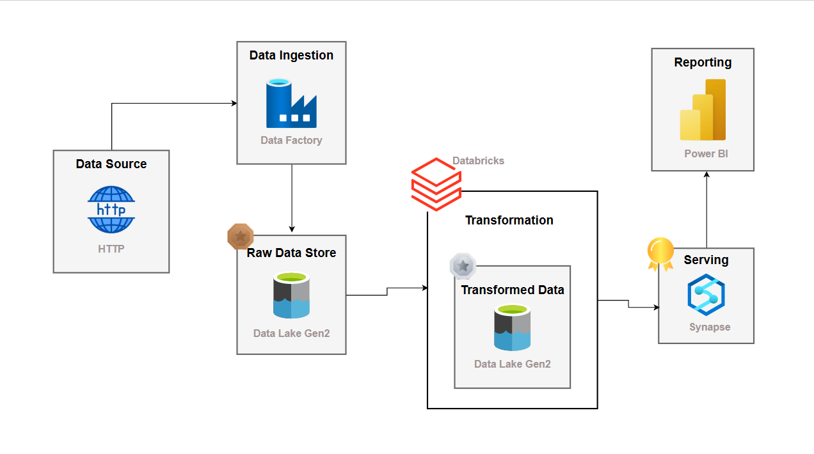
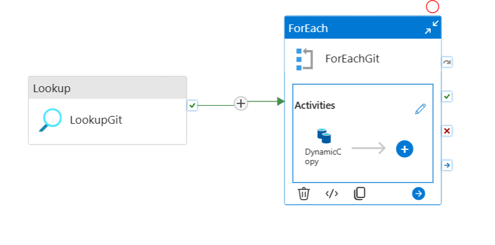

# Azure Data Lakehouse Pipeline

An end-to-end cloud data engineering pipeline built on Microsoft Azure using the **AdventureWorks** dataset. Raw CSV data is ingested from GitHub via Azure Data Factory, transformed using PySpark on Azure Databricks, and served through Azure Synapse Analytics Serverless SQL as external Parquet tables for reporting.

**Built with:** Azure Data Factory · Azure Data Lake Storage Gen2 · Azure Databricks · PySpark · Azure Synapse Analytics · Parquet · SQL

---

## Architecture



---

## ADF Pipeline



---

## Dataset — AdventureWorks

10 CSV files sourced directly from GitHub via HTTP linked service:

| File | Records | Description |
|---|---|---|
| AdventureWorks_Sales_2015 | 2,630 | Sales transactions 2015 |
| AdventureWorks_Sales_2016 | 23,935 | Sales transactions 2016 |
| AdventureWorks_Sales_2017 | 29,481 | Sales transactions 2017 |
| AdventureWorks_Customers | 18,148 | Customer demographics |
| AdventureWorks_Products | 293 | Product catalog |
| AdventureWorks_Product_Categories | 4 | Product category lookup |
| AdventureWorks_Product_Subcategories | 37 | Product subcategory lookup |
| AdventureWorks_Returns | 1,809 | Return transactions |
| AdventureWorks_Territories | 10 | Sales territories |
| AdventureWorks_Calendar | 912 | Date dimension |

**Total records: ~77,000 rows across 10 tables**

---

## Pipeline Flow

### Bronze Layer — Raw Ingestion (ADF)

Two ADF pipelines built to ingest raw CSV data from GitHub into ADLS Gen2:

**Pipeline 1 — `GitToRaw` (Static)**
- Single Copy Activity pulling one CSV file via HTTP GET from GitHub
- Source: `ds_http` (HTTP linked service to `raw.githubusercontent.com`)
- Sink: `ds_raw` (ADLS Gen2 Bronze container)

**Pipeline 2 — `GitToRawDynamic` (Parameterised)**
- `LookupGit` activity reads a `git.json` parameter file from ADLS Gen2
- `ForEachGit` iterates over every file entry in the JSON config
- `DynamicCopy` activity uses `@item().p_rel_url` for source URL and `@item().p_sink_folder` / `@item().p_sink_filename` for destination
- Ingests all 10 CSV files in a single parameterised pipeline run

### Silver Layer — PySpark Transformation (Databricks)

`Databricks/silver_layer.ipynb` reads from Bronze, applies transformations, and writes Parquet to Silver.

**Transformations applied per table:**

| Table | Transformation |
|---|---|
| Calendar | Extracted `Month` and `Year` columns from `Date` using `month()` and `year()` |
| Customers | Created `FullName` by concatenating `Prefix`, `FirstName`, `LastName` using `concat_ws()` |
| Products | Extracted base `ProductSKU` using `split(col("ProductSKU"),'-')[0]` · Extracted first word of `ProductName` using `split()` |
| Sales | Converted `StockDate` to timestamp · Replaced `'S'` prefix with `'T'` in `OrderNumber` using `regexp_replace()` · Added `Multiply` column as `OrderLineItem * OrderQuantity` |
| Returns, Territories, Subcategories | Loaded and written to Silver as-is (no transformation required) |

All tables written to Silver as **Parquet format** using `append` mode via `abfss://silver@awstoragedatalake981.dfs.core.windows.net/`.

**Sales Analysis query run in Databricks:**
```python
df_sales.groupBy('OrderDate').agg(count('OrderNumber').alias('TotalOrder')).display()
```

### Gold Layer — Synapse Serverless SQL

**`Create Views Gold.sql`** — creates 8 views over Silver Parquet files using `OPENROWSET`:
- `gold.calendar`, `gold.customers`, `gold.products`, `gold.returns`
- `gold.sales`, `gold.territories`, `gold.prod_categories`, `gold.prod_subcategories`

**`External Table.sql`** — creates external tables over Gold Parquet with Snappy compression:
- Managed Identity credential (`cred_981`) for secure ADLS Gen2 access
- External data sources pointing to Silver and Gold containers
- Parquet file format with `SnappyCodec` compression
- 8 external tables: `extsales`, `extcalendar`, `extcustomers`, `extproducts`, `extreturns`, `extterritories`, `extpro_category`, `extpro_subcategory`

---

## Project Structure

```
azure-data-lakehouse-pipeline/
│
├── ADF/                              # Azure Data Factory configs (version controlled)
│   ├── dataset/
│   │   ├── ds_http.json              # HTTP source dataset (GitHub)
│   │   ├── ds_raw.json               # ADLS Gen2 sink dataset (Bronze)
│   │   ├── ds_git_dynamic.json       # Parameterised source dataset
│   │   ├── ds_git_parameter.json     # Parameter file dataset (git.json lookup)
│   │   └── ds_sink_dynamic.json      # Parameterised sink dataset
│   ├── linkedService/
│   │   ├── httplinkedservice.json    # HTTP linked service (raw.githubusercontent.com)
│   │   └── storagedatalake.json      # ADLS Gen2 linked service
│   ├── pipeline/
│   │   ├── GitToRaw.json             # Static ingestion pipeline
│   │   └── GitToRawDynamic.json      # Dynamic parameterised ingestion pipeline
│   └── publish_config.json
│
├── Data/                             # Source AdventureWorks CSV files (10 tables)
│
├── Databricks/
│   └── silver_layer.ipynb            # PySpark Bronze → Silver transformation notebook
│
├── Synapse/
│   ├── Create Schema.sql             # Creates gold schema
│   ├── Create Views Gold.sql         # 8 Gold views via OPENROWSET over Silver Parquet
│   └── External Table.sql            # Managed Identity, external sources, 8 external tables
│
├── Architecture_Diagram.png
├── ADFPipeline.png
└── README.md
```

---

## Tech Stack

| Service | Purpose |
|---|---|
| Azure Data Factory | Pipeline orchestration, HTTP ingestion, parameterised ForEach loops |
| Azure Data Lake Storage Gen2 | Layered storage — Bronze (raw CSV), Silver (Parquet), Gold (external tables) |
| Azure Databricks | PySpark transformations — type casting, string manipulation, derived columns |
| Azure Synapse Analytics | Serverless SQL — OPENROWSET views and Parquet external tables |
| Parquet + Snappy | Columnar compressed storage format for Silver and Gold layers |

---

## Key Concepts Demonstrated

- **Medallion Architecture** — Bronze → Silver → Gold layered data design
- **Parameterised ADF Pipelines** — Lookup + ForEach pattern for dynamic multi-file ingestion
- **PySpark Transformations** — `withColumn`, `concat_ws`, `split`, `regexp_replace`, `to_timestamp`, `month`, `year`
- **Serverless SQL** — `OPENROWSET` views over ADLS Gen2 Parquet files
- **External Tables** — Managed Identity authentication, Snappy-compressed Parquet export
- **Infrastructure as Code** — All ADF pipeline and dataset configs version controlled as JSON
